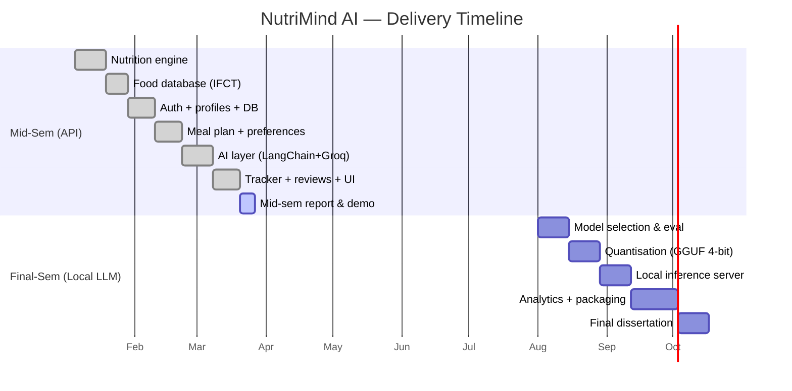

# NutriMind AI — Project Plan

**Project:** NutriMind AI — A Region-Aware, AI-Assisted Personalised Diet-Planning System for Indian Users
**Programme:** BITS Pilani — Dissertation
**Student:** Harsha
**Milestone:** Mid-Semester Review
**Document version:** 2.0

---

## 1. Problem statement

Generic calorie counters and diet apps are built around Western foods and ignore
the **regional diversity of Indian cuisine**. They also force users to self-diagnose
their goal (lose / maintain / gain) and rarely explain *how* to cook the food they
recommend. NutriMind AI addresses three gaps:

1. **Regional relevance** — meal plans drawn from foods local to the user's region
   of India (North / South / East / West / Pan-India), referenced to the
   **Indian Food Composition Tables (IFCT 2017, NIN/ICMR)**.
2. **Clinical grounding** — BMI, BMR and calorie targets computed from validated
   formulas (WHO, Mifflin-St Jeor, Harris-Benedict), never guessed by an AI.
3. **Actionable guidance** — an LLM layer that writes cooking tips, healthy recipes
   and progress summaries on top of the trustworthy numbers.

## 2. Objectives

| # | Objective | Status |
|---|-----------|--------|
| O1 | Clinical nutrition engine (BMI/BMR/TDEE/target) | ✅ Done |
| O2 | Region-tagged Indian food database (IFCT-referenced) | ✅ Done |
| O3 | User accounts, profiles & persistence (SQLite) | ✅ Done |
| O4 | Preference-aware day meal-plan generator | ✅ Done |
| O5 | AI guidance / recipe / goal layer (LangChain + Groq) | ✅ Done (API) |
| O6 | Goal tracker with AI day-scoring | ✅ Done |
| O7 | Feedback / review capture | ✅ Done |
| O8 | **Migrate AI to a local quantised open-source LLM** | 🔜 Final sem |
| O9 | Longitudinal analytics & mobile packaging | 🔜 Final sem |

## 3. Scope

**In scope (mid-sem):** web platform with auth, profile, preference-driven meal
plans, AI recipe generator, goal tracker, reviews; cloud LLM via Groq free tier
with a deterministic rule-based fallback.

**In scope (final sem):** replace the cloud LLM with a **locally hosted, quantised
7B model** (4-bit, llama.cpp / GGUF) so the system runs fully offline with no API
cost; add weight-trend analytics and packaging. See
[`07_QUANTIZATION_ROADMAP.md`](07_QUANTIZATION_ROADMAP.md).

**Out of scope:** medical diagnosis, prescription, or treatment. NutriMind AI is a
wellness aid, not a clinical device.

## 4. Phased plan & status

**Overall completion at mid-sem: ~55%** — the full API-backed platform is
functional; the headline final-semester contribution (local quantised inference)
and longitudinal analytics remain.

## 5. Deliverables checklist

- [x] Working web application (FastAPI + SQLite + vanilla JS SPA)
- [x] LangChain + Groq AI integration with rule-based fallback
- [x] End-to-end self-test (`python -m app.selftest`, 13 checks)
- [x] Planning documentation & diagrams (this `docs/` folder)
- [x] One-click setup & run scripts (`setup.bat`, `run.bat`)
- [x] Mid-semester report & viva presentation
- [x] Knowledge-Transfer (KT) document
- [ ] Local quantised LLM (final sem)

## 6. Risks & mitigations

| Risk | Likelihood | Mitigation |
|------|-----------|------------|
| Cloud LLM rate limits / downtime | Medium | Deterministic rule-based fallback always available |
| LLM hallucinating calorie numbers | High impact | **Numbers come only from the IFCT DB**; LLM writes text only |
| Local quantised model too large for laptop | Medium | 4-bit GGUF quant + 7B model keeps RAM < 6 GB |
| Food data accuracy | Medium | Values referenced to IFCT 2017 (NIN/ICMR) |
| Secret leakage (API key) | Low | `.env` gitignored; key rotated before submission |

## 7. Success criteria

- Meal plan lands within **±10%** of the computed calorie target (achieved: ~91–100%).
- App runs end-to-end with **zero paid dependencies**.
- AI features degrade gracefully when offline (fallback verified).
- Reproducible **one-click** setup on a fresh Windows machine.
