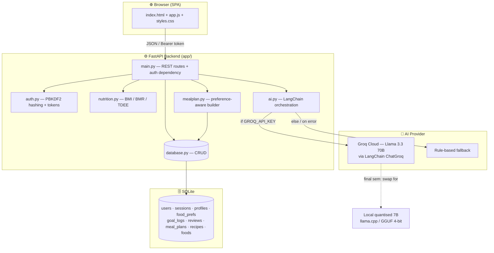
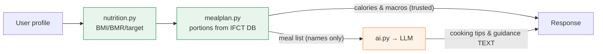
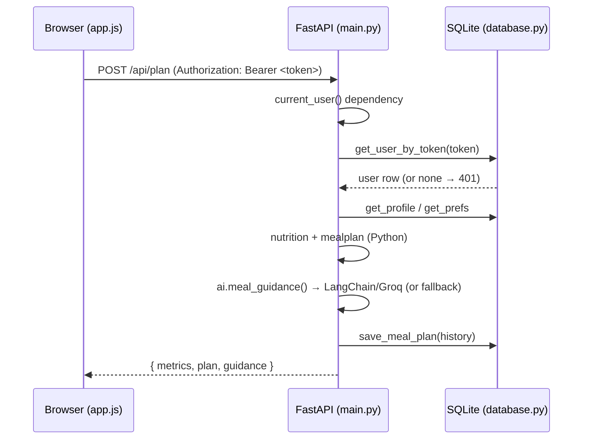

# NutriMind AI — System Architecture

## 1. High-level architecture

NutriMind AI is a three-tier application: a **vanilla-JS single-page frontend**, a
**FastAPI backend** exposing a JSON API, and an **SQLite** data store. The AI layer
is orchestrated through **LangChain** and served by the **Groq** cloud LLM (mid-sem),
with a deterministic rule-based fallback. The same interface will be re-pointed at a
**local quantised LLM** in the final semester.

## 2. Component responsibilities

| Module | Responsibility | Key property |
|--------|----------------|--------------|
| `frontend/` | SPA: auth, dashboard, profile, plan, prefs, recipe, tracker, reviews | No build step; talks JSON |
| `app/main.py` | Route definitions, request validation (Pydantic), auth dependency | Thin controller |
| `app/auth.py` | PBKDF2-HMAC-SHA256 password hashing, opaque session tokens | Stdlib only |
| `app/nutrition.py` | BMI (WHO), BMR (Mifflin-St Jeor), TDEE (Harris-Benedict), target kcal | **Pure functions, unit-testable** |
| `app/foods.py` | IFCT-referenced food dataset + preference-card definitions | Single source of truth |
| `app/database.py` | Schema, seeding, all SQL CRUD | All I/O lives here |
| `app/mealplan.py` | Greedy day-plan builder, preference filtering, calorie normalisation | Numbers from DB |
| `app/ai.py` | LangChain + Groq calls; structured outputs; fallback | LLM writes **text only** |

## 3. Core design rule — separation of numbers and text

> **The LLM never produces nutrition numbers.** All calories/macros come from the
> IFCT-referenced database and the Python nutrition engine. The model only writes
> recipe and guidance text. This guarantees clinical trustworthiness regardless of
> which LLM (cloud or local) is plugged in.

## 4. Technology stack

| Layer | Choice | Why |
|-------|--------|-----|
| Backend | Python 3.13 · FastAPI · Uvicorn | Async, typed, auto-docs |
| Validation | Pydantic v2 (+ email-validator) | Declarative request schemas |
| Storage | SQLite | Zero-config, single-file, portable |
| Auth | PBKDF2-HMAC-SHA256 (stdlib) + token sessions | No paid/3rd-party crypto dep |
| AI orchestration | LangChain (`langchain`, `langchain-groq`) | Prompt templates + structured output |
| LLM (mid-sem) | Groq · `llama-3.3-70b-versatile` | Free tier, fast, Llama family |
| LLM (final sem) | Local quantised 7B (GGUF 4-bit) | Offline, zero cost, privacy |
| Frontend | HTML + CSS + vanilla JS | No build; one-click deploy |
| Config | `python-dotenv` (`.env`) | Secrets out of source control |

## 5. Request lifecycle (authenticated call)

## 6. Deployment model

- **Mid-sem:** single-node `uvicorn` on `localhost:8000`; SQLite file in `data/`.
  One-click via `setup.bat` (install) and `run.bat` (launch).
- **Final-sem:** same process plus a local inference sidecar (llama.cpp server);
  `ai.py` switched from `ChatGroq` to a local OpenAI-compatible endpoint — no other
  code changes thanks to the LangChain abstraction.
