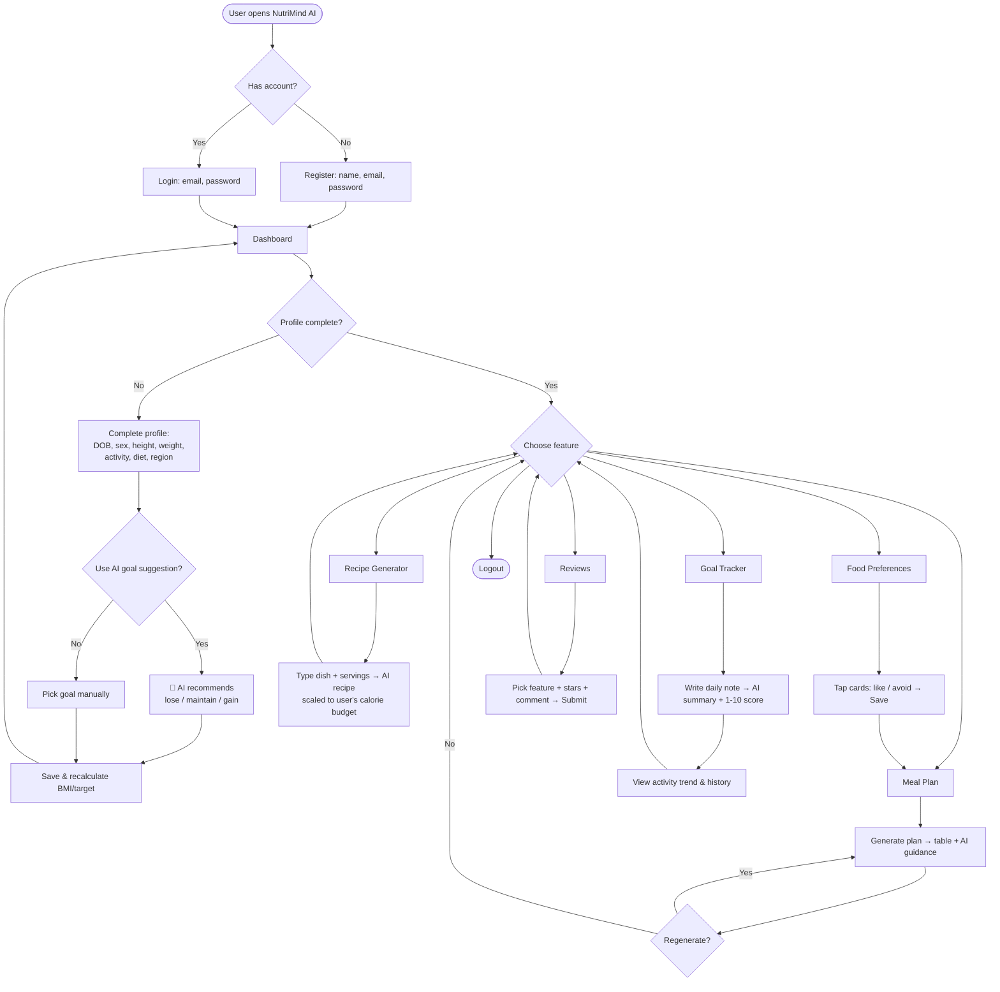
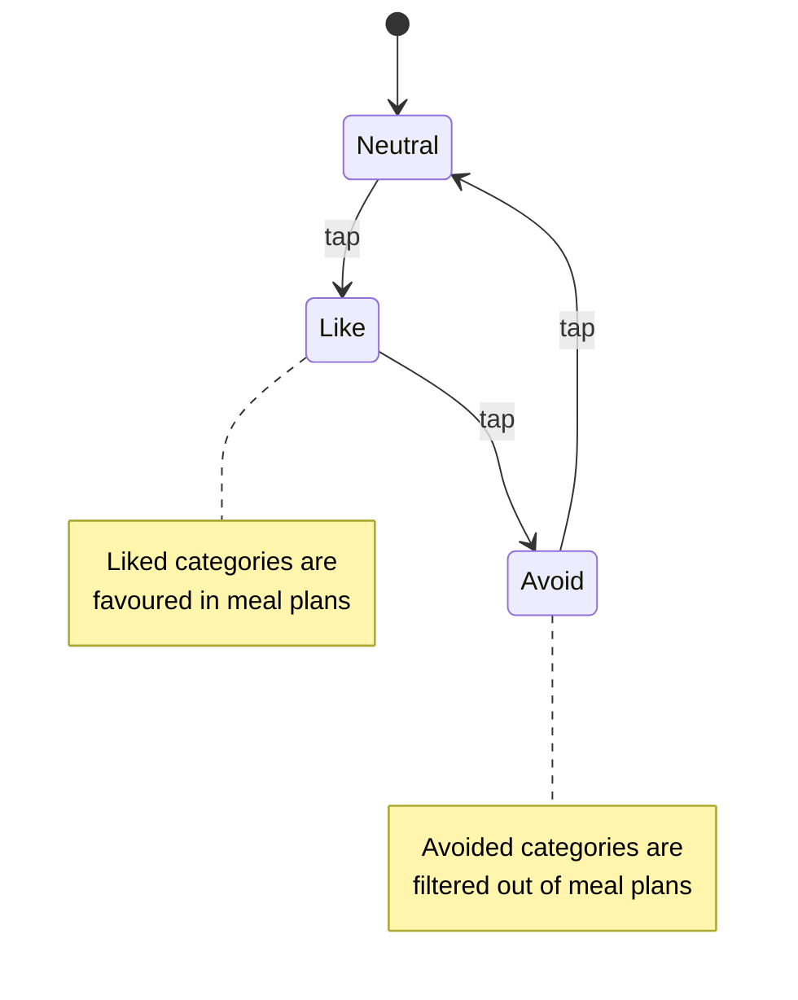
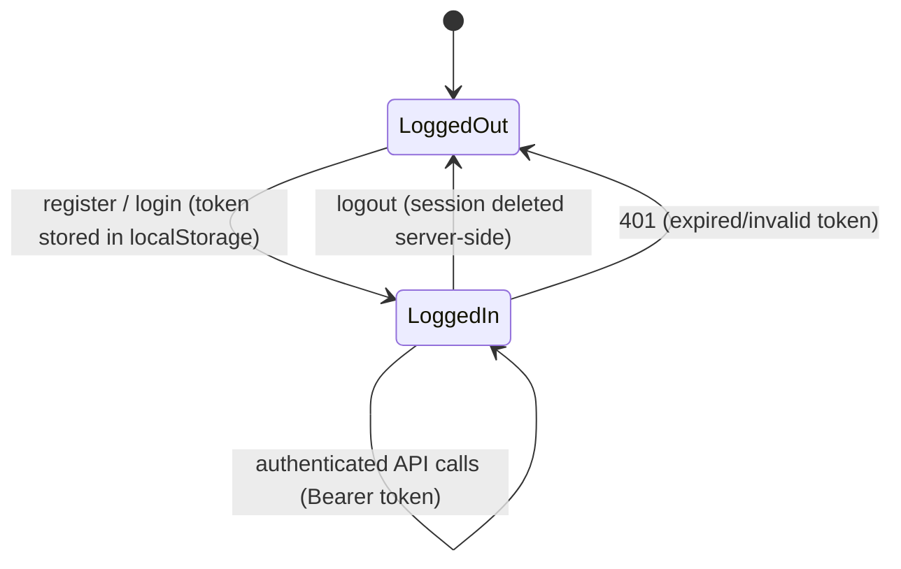

# NutriMind AI — User Flow

## 1. End-to-end user journey

## 2. Screen map

| Screen | Purpose | Primary API |
|--------|---------|-------------|
| Auth (Login/Register) | Account creation & sign-in | `/api/auth/*` |
| Dashboard | Snapshot: BMI, category, target, activity avg | `/api/me` |
| Profile | Biometrics + AI goal suggestion | `/api/profile`, `/api/suggest-goal` |
| Meal Plan | Day plan table + AI guidance | `/api/plan` |
| Food Preferences | Tap-to-pick like/avoid cards | `/api/food-cards`, `/api/preferences` |
| Recipe | Healthy recipe scaled to the user | `/api/recipe` |
| Goal Tracker | Daily note → AI score + trend | `/api/log`, `/api/logs` |
| Reviews | Feedback capture | `/api/review`, `/api/reviews` |

## 3. Preference card interaction

## 4. Authentication state

