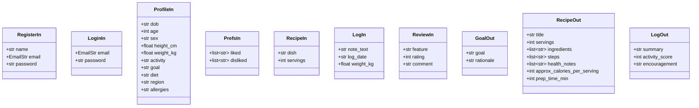
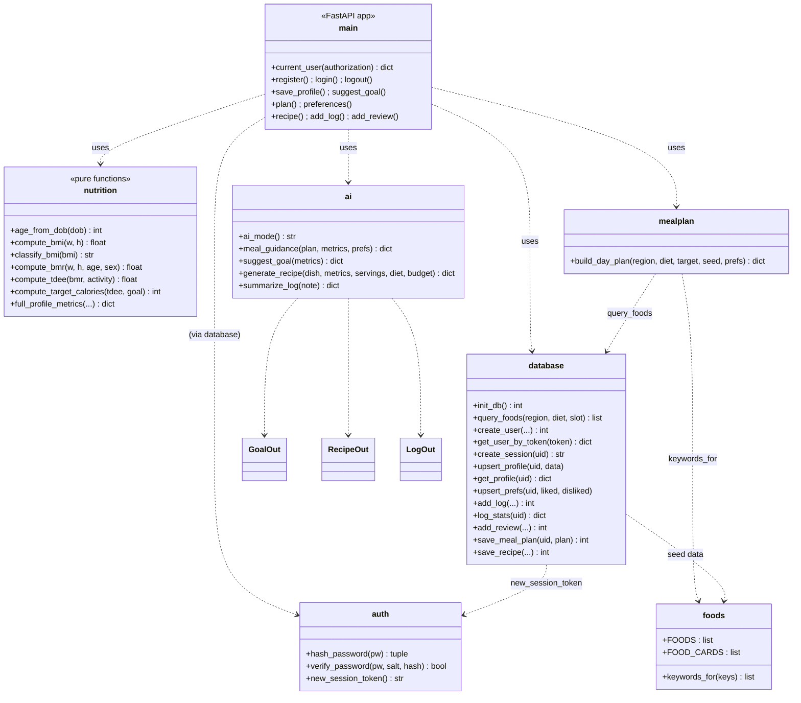

# NutriMind AI — Module & Class Diagram

Python is organised as cohesive modules (pure functions + Pydantic schemas) rather
than a deep class hierarchy. The diagram below shows the request schemas, the AI
structured-output models, and the functional contracts of each module.

## 1. Pydantic schemas & AI models

## 2. Module contracts

## 3. Design principles applied

- **Single responsibility:** I/O isolated in `database.py`; math isolated in
  `nutrition.py` (pure, unit-testable).
- **Dependency direction:** `main` depends on services; services depend on
  `database`; nothing depends on `main`.
- **Provider abstraction:** `ai.py` is the only module that knows about the LLM —
  swapping Groq for a local model touches one file.
- **Schema-first validation:** every endpoint input is a Pydantic model; invalid
  requests are rejected with 422 before any handler logic runs.
