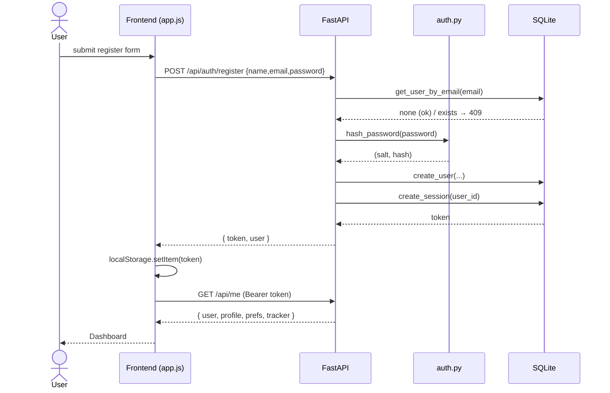
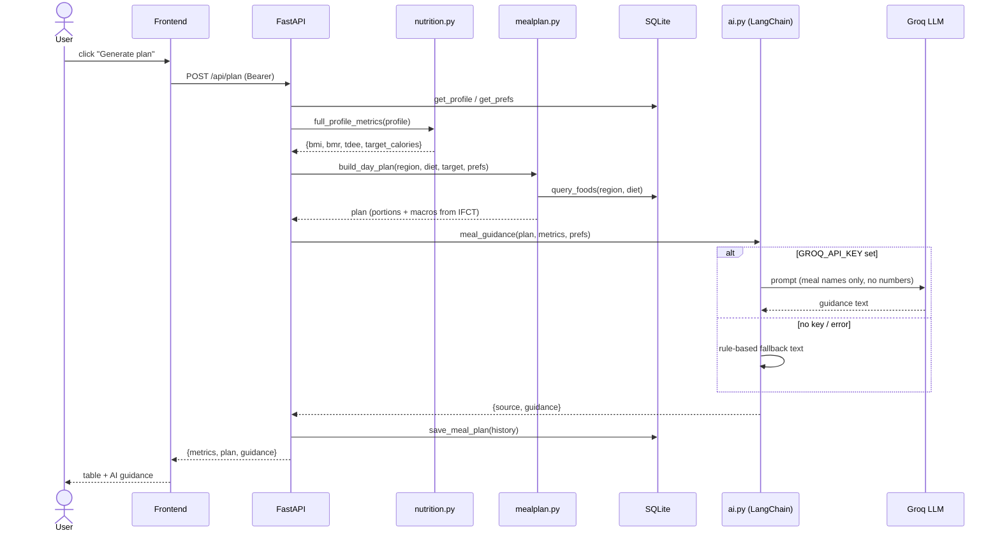
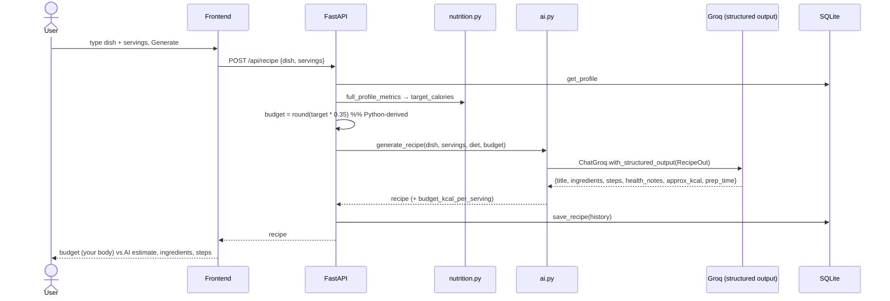
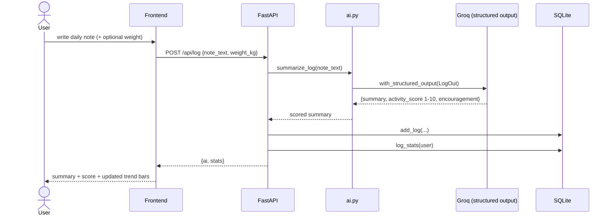

# NutriMind AI — Sequence Diagrams

## 1. Registration & login

## 2. AI meal plan (numbers from DB, text from LLM)

## 3. AI recipe — structured output, scaled to the user

## 4. Goal tracker — AI day scoring

