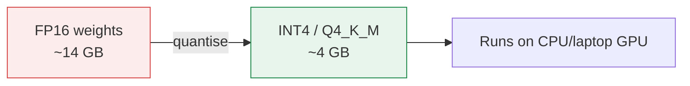
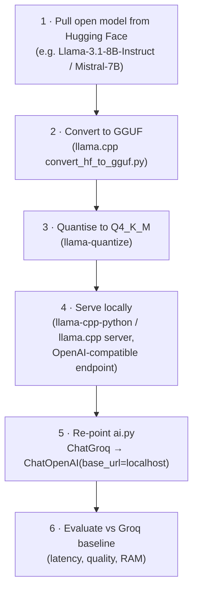
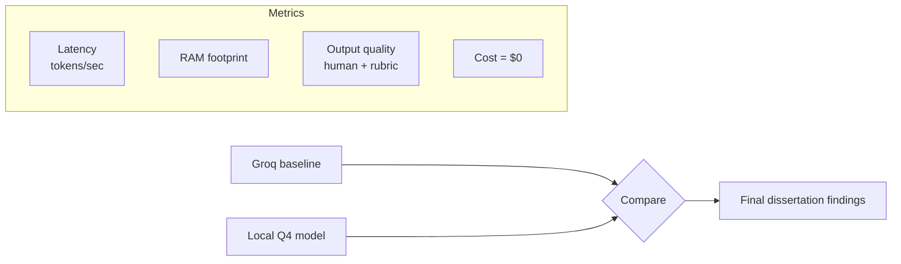

# NutriMind AI — Local Quantised LLM Roadmap (Final Semester)

The headline contribution of the final semester is to **remove the cloud dependency**
and run the AI layer entirely on a **local, quantised, open-source LLM**. This gives
zero API cost, full data privacy, and offline operation — while keeping the same
trustworthy "numbers from the database, text from the model" guarantee.

## 1. Why quantisation

A full-precision 7B-parameter model needs ~28 GB (FP32) or ~14 GB (FP16) of memory —
impractical on a student laptop. **Quantisation** stores weights at lower precision
(e.g. 4-bit) so the same model fits in **~4–6 GB RAM** with minor quality loss.



| Precision | Bits/weight | 7B size (approx) | Fits laptop? |
|-----------|------------|------------------|--------------|
| FP32 | 32 | ~28 GB | ❌ |
| FP16 | 16 | ~14 GB | ⚠️ high-end only |
| INT8 | 8 | ~7 GB | ⚠️ |
| **Q4_K_M (4-bit)** | ~4.5 | **~4–4.5 GB** | ✅ target |

## 2. Pipeline



## 3. Candidate models

| Model | Params | License | Notes |
|-------|--------|---------|-------|
| Llama 3.1 8B Instruct | 8B | Llama Community | Same family as the mid-sem Groq model — clean comparison |
| Mistral 7B Instruct | 7B | Apache-2.0 | Permissive, strong instruction following |
| Qwen2.5 7B Instruct | 7B | Apache-2.0 | Strong multilingual, good for Indian-English |
| Phi-3 mini | 3.8B | MIT | Smallest fallback for low-RAM machines |

## 4. Why the swap is low-risk

Because the AI layer is isolated behind LangChain in `app/ai.py`, switching providers
is a **one-file change**. The function signatures (`meal_guidance`, `generate_recipe`,
`summarize_log`, `suggest_goal`) and the structured-output models (`RecipeOut`,
`LogOut`, `GoalOut`) stay identical — only the model client changes:

```python
# Mid-sem (cloud)
from langchain_groq import ChatGroq
llm = ChatGroq(model="llama-3.3-70b-versatile")

# Final-sem (local, OpenAI-compatible llama.cpp server)
from langchain_openai import ChatOpenAI
llm = ChatOpenAI(base_url="http://localhost:8080/v1",
                 api_key="local", model="local-q4")
```

The deterministic rule-based fallback remains in place, so the app keeps working even
if the local server is down.

## 5. Evaluation plan



**Hypothesis:** a 4-bit quantised 7B model can match the perceived quality of the
mid-sem cloud setup for this constrained, templated task (recipes, tips, day
summaries) at acceptable laptop latency — validating a fully local, free,
privacy-preserving deployment.
